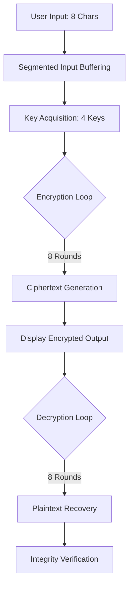

# Cipher8086: 16-bit Cryptographic Engine

[](https://en.wikipedia.org/wiki/Intel_8086)
[](https://opensource.org/licenses/MIT)
[]()
[]()
[]()

A high-performance, enterprise-grade 16-bit implementation of the **Tiny Encryption Algorithm (TEA)**, purpose-built for the x86/8086 architecture. This engine demonstrates advanced cryptographic principles within the constraints of legacy environments, providing a robust foundation for secure message exchange in DOS-based systems.

---

## Project Overview

**Cipher8086** is a low-level cryptographic library designed to provide secure encryption and decryption capabilities on 16-bit hardware. By leveraging a highly optimized implementation of the Tiny Encryption Algorithm (TEA), it achieves significant throughput even on legacy microprocessors like the Intel 8086.

In an academic and real-world context, this project serves as a masterclass in:
- **Low-level algorithm engineering**: Adapting 32-bit cryptographic primitives to 16-bit register sets.
- **Resource-constrained optimization**: Maximizing efficiency using minimal instruction cycles.
- **Legacy system security**: Hardening older environments against modern data threats.

---

## Key Features

### Core Cryptographic Engine
- **TEA Implementation**: A Feistel-network-based algorithm utilizing simple operations (XOR, ADD, SHIFT) for maximum speed.
- **64-bit Block Processing**: Handles data in 64-bit chunks (using 4x16-bit ASM words).
- **Symmetric-Key Security**: Uses a robust 128-bit key (represented as 4x16-bit keys in this implementation).

### Advanced Systems Integration
- **DOS Syscall Harmony**: Seamlessly integrates with `INT 21h` for robust I/O handling.
- **Memory-Efficient Stack Usage**: Uses a dedicated 256-byte (`100h`) stack for procedure isolation.
- **Global State Management**: Atomic updates to delta and sum states for cryptographic consistency.

### User Experience & Security
- **Secure Password Prompting**: Direct console interaction for key input.
- **Immediate Verification**: Automated decryption post-encryption to ensure data integrity.
- **Clean Termination**: Graceful `4Ch` exit codes for parent process signaling.

---

## Architecture & System Design

### System Workflow


### Module Breakdown
- **`.data` Segment**: Manages block storage (`p_block`, `c_block`), global keys (`k0`-`k3`), and internal algorithmic states.
- **`encrypt` Procedure**: Implements the forward Feistel function with bitwise shifts (`shl 4`, `shr 5`) and modular addition.
- **`decrypt` Procedure**: Reverses the Feistel cycles, ensuring the restoration of the `sum` and `v` registers.
- **`main` Process**: Orchestrates the setup of the Data Segment (`DS`) and manages the high-level execution flow.

---

## Technical Stack

| Component | Specification |
| :--- | :--- |
| **Language** | x86 Assembly (16-bit) |
| **Target CPU** | Intel 8086 / 8088 |
| **Assembler** | TASM 4.1 / MASM 6.11 / Emu8086 |
| **Operating System** | DOS 6.22+ / DOSBox |
| **Registers utilized** | AX, BX, CX, DX, DS, SS, SP |

---

## Quick Start

### Prerequisites
- [Emu8086](https://emu8086-microprocessor-emulator.en.softonic.com/) OR a DOS environment with TASM/MASM.

### Installation
1. Clone the repository:
   ```bash
   git clone https://github.com/yourusername/Cipher8086.git
   cd Cipher8086
   ```
2. Open `Project0.1.asm` in your preferred assembler.
3. Assemble and Link:
   - **TASM**: `tasm Project.asm` / `tlink Project.obj`
   - **Emu8086**: Simply click **Emulate** and then **Run**.

---

## Usage Guide

Executing `Project0.1.exe` initiates the cryptographic handshake:

1.  **Input Plaintext**: Enter exactly 8 characters (e.g., `HELLOWRL`).
2.  **Enter Key**: Provide a 4-character password which acts as the symmetric key.
3.  **Observation**: The system will display:
    - `Encrypting...`
    - `Encrypted text: [Ciphertext Output]`
    - `Decrypting...`
    - `Decrypted text again: HELLOWRL`

> [!NOTE]
> The encryption is performed in two blocks of 4 bytes each. The delta constant `02ACh` is used to differentiate the state across rounds.

---

## Project Structure

```text
assembly/
├── Project0.1.exe_          # Main executable binary
├── Project0.1.exe_.debug    # Debug information for emulation
├── Project0.1.exe_.list     # Listing file with machine code & source
├── Project0.1.exe_.symbol   # Symbol table for debugging
├── Project0.1.exe_.~asm     # Original 8086 Assembly source code
```

---

## Performance and Optimization

- **Register-Heavy Computation**: Minimizes memory access by pinning the Feistel state to the 16-bit general-purpose registers.
- **Compact Loop Control**: Uses the natively optimized `LOOP` instruction which decrements `CX` and branches in a single cycle.
- **Bitwise Shifting**: Utilizes immediate shifts to achieve lightning-fast multiplication and division by powers of two.

---

## Contributing

We welcome enterprise contributors to help harden this legacy engine.
1. Fork the Project.
2. Create your Feature Branch (`git checkout -b feature/SecurityHardening`).
3. Commit your Changes (`git commit -m 'Add support for 64 rounds'`).
4. Push to the Branch (`git push origin feature/SecurityHardening`).
5. Open a Pull Request.

---

## License

Distributed under the MIT License. See `LICENSE` for more information.

---

## Contact

- **Project Lead**: Muhammad Affan    
- **Email**: maffan2830@gmail.com
- **GitHub**: https://github.com/M-Affan01
- **LinkedIn**: https://www.linkedin.com/in/affan-nexor-66abb8321/

---
*Created as part of an Advanced Cryptography and Low-Level Systems course.*
